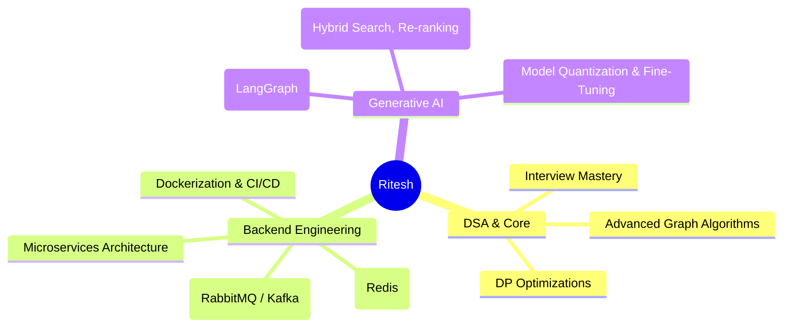

  

  

---
### 🏆 Honors & Extracurriculars
- 🥇 **QuasarXAI 2026:** Cleared Ideathon stage with Healthcare AI Patient Management & Bot.
- 💡 **Smart India Hackathon 2024:** Qualified college-level Ideathon with **Bhraman** travel ecosystem.
- ⚽ **IIIT Ranchi Football Team:** Active core team player.
- 🏸 **IIIT Ranchi Badminton:** Tournament Runner-up in intra-college championship.
- 🎙️ **Event Lead — Hindi Pakhwada:** Organized and led an institutional event with 100+ participants.
---
### 🧭 Active Exploration & Roadmap

---

  <!-- Dynamic Footer Wave -->
  
  
  
<em>"Building resilient systems at the intersection of robust backend infrastructure and applied intelligence."</em>

  
⭐ <b>Feel free to explore my repositories and drop a star if you find something useful!</b> ⭐

